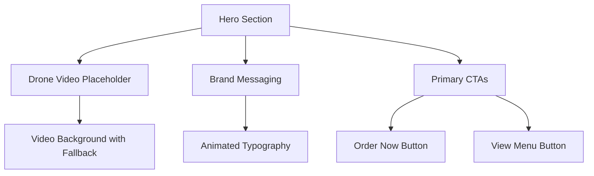
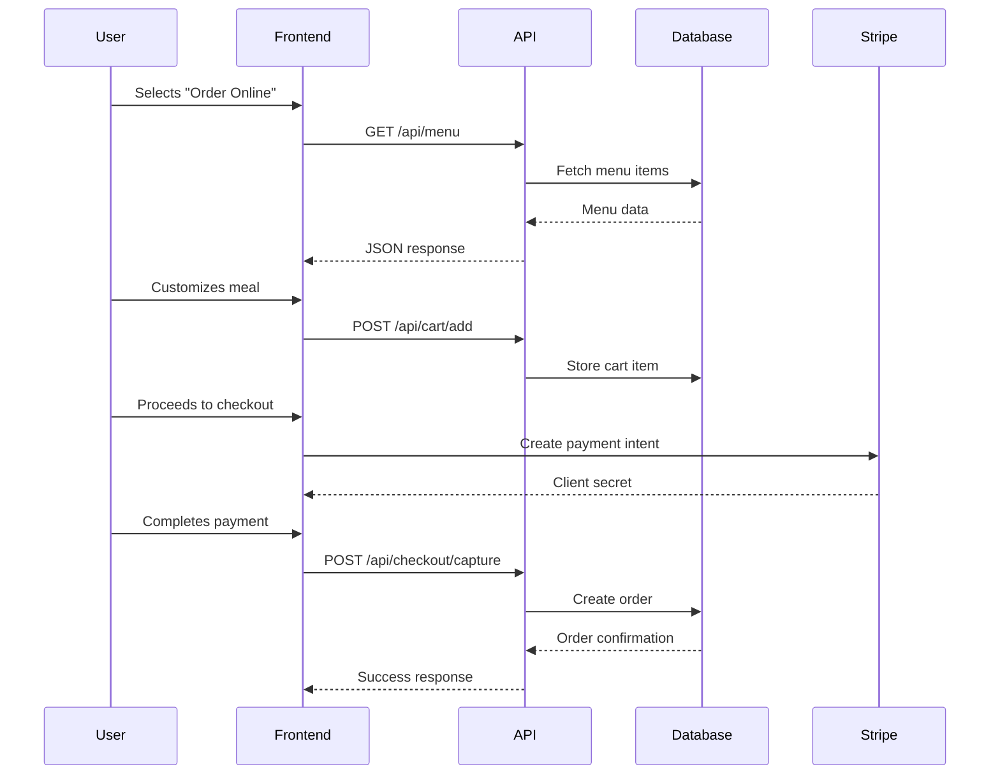
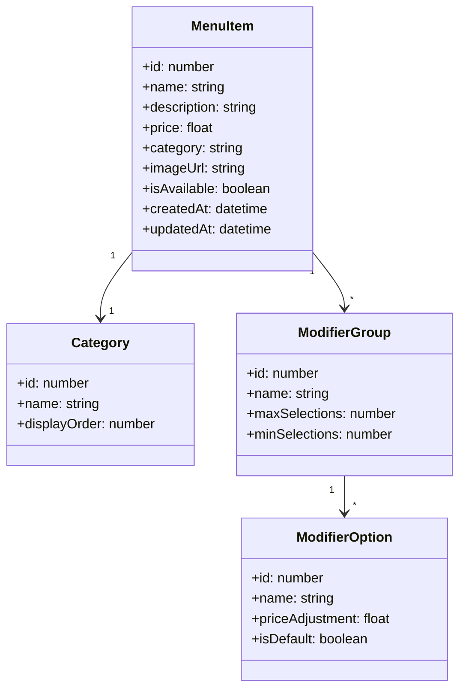
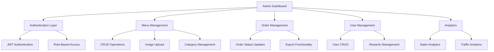

# Habiburrito Restaurant Website Architecture Plan

## Executive Summary

This document outlines the comprehensive architecture plan for the Habiburrito fast-casual dining website, inspired by Chipotle's ordering experience with premium aesthetics from GAO's BBQ and PropsWR.

## Current State Analysis

### Existing Implementation Strengths:
- **Tech Stack**: Next.js 16, React 19, TypeScript, Tailwind CSS, Prisma ORM, PostgreSQL, Stripe
- **Core Features**: Build-your-own meal system, Stripe checkout, basic admin dashboard
- **Design**: Premium dark theme with gold accents, responsive layout
- **Performance**: Optimized for fast load times

### Identified Gaps:
1. **Hero Section**: Needs drone video integration
2. **Ordering Flow**: Requires conversion optimization
3. **Menu System**: Needs dynamic admin-editable functionality
4. **About Us**: Missing narrative with video integration
5. **Locations**: Needs interactive map and pickup zones
6. **Admin Dashboard**: Requires full CRUD functionality
7. **Social Integration**: Missing embedded feeds
8. **ADA Compliance**: Needs refinement

## Proposed Architecture

### 1. Hero Section


### 2. Ordering & Pickup System


### 3. Dynamic Menu System


### 4. Admin Dashboard Architecture


## Phased Rollout Strategy

### Phase 1: Foundation & Core Features (Weeks 1-2)
- [ ] Complete hero section with drone video placeholder
- [ ] Enhance ordering flow with conversion optimization
- [ ] Implement basic menu management in admin
- [ ] Set up locations page with interactive map
- [ ] Integrate social media feeds

### Phase 2: Advanced Features (Weeks 3-4)
- [ ] Full admin dashboard CRUD functionality
- [ ] Dynamic menu system with real-time updates
- [ ] About Us section with video integration
- [ ] ADA compliance refinements
- [ ] Performance optimization

### Phase 3: Polish & Launch (Weeks 5-6)
- [ ] Final design refinements
- [ ] Comprehensive testing
- [ ] Client approval process
- [ ] Deployment preparation
- [ ] Marketing integration

## Technical Specifications

### Frontend Architecture
```typescript
// Next.js App Router Structure
app/
├── (marketing)/
│   ├── page.tsx          # Hero & Home
│   ├── menu/
│   │   └── page.tsx      # Menu System
│   ├── order/
│   │   └── page.tsx      # Ordering Flow
│   ├── locations/
│   │   └── page.tsx      # Locations
│   └── our-story/
│       └── page.tsx      # About Us
├── (admin)/
│   └── dashboard/
│       └── page.tsx      # Admin Dashboard
└── api/
    ├── menu/
    │   └── route.ts       # Menu API
    ├── orders/
    │   └── route.ts       # Orders API
    └── admin/
        └── route.ts       # Admin API
```

### Database Schema Enhancements
```prisma
model MenuItem {
  id          Int      @id @default(autoincrement())
  name        String
  description String
  basePrice    Float
  categoryId  Int
  category    Category @relation(fields: [categoryId], references: [id])
  imageUrl    String?
  isAvailable Boolean   @default(true)
  modifiers   ModifierGroup[]
  createdAt   DateTime @default(now())
  updatedAt   DateTime @updatedAt
}

model Category {
  id            Int      @id @default(autoincrement())
  name          String
  displayOrder  Int      @default(0)
  menuItems     MenuItem[]
}

model Location {
  id          Int      @id @default(autoincrement())
  name        String
  address     String
  city        String
  state       String
  zipCode     String
  phone       String
  hours       Json
  pickupZones  Json
  coordinates Json
}
```

## Design System

### Color Palette
```css
:root {
  --brand-black: #050505;
  --brand-dark-gray: #121212;
  --brand-gold: #D4AF37;
  --brand-orange: #E65100;
  --brand-cream: #F5F5DC;
  --brand-ember: #C25A29;
  --brand-jade: #0BAF87;
  --brand-night: #0B0B0B;
}
```

### Typography
```css
@font-face {
  font-family: 'Outfit';
  src: url('/fonts/outfit.woff2') format('woff2');
  font-weight: 400 900;
  font-display: swap;
}

@font-face {
  font-family: 'Inter';
  src: url('/fonts/inter.woff2') format('woff2');
  font-weight: 400 700;
  font-display: swap;
}
```

## SEO & Marketing Integration

### Meta Tags Strategy
```html
<meta name="description" content="Premium halal fast-casual dining with build-your-own bowls, burritos, and tacos. Order online for pickup or delivery.">
<meta property="og:title" content="Habiburrito - Premium Halal Fast Casual Dining">
<meta property="og:description" content="Experience the gold standard of halal dining. Customize your meal with premium ingredients.">
<meta property="og:image" content="/og-image.jpg">
<meta property="og:url" content="https://habiburrito.com">
<meta name="twitter:card" content="summary_large_image">
```

### Social Media Integration
```javascript
// Instagram Feed Component
const InstagramFeed = () => {
  const [posts, setPosts] = useState([]);

  useEffect(() => {
    // Fetch Instagram posts via API or embed
    const fetchPosts = async () => {
      const response = await fetch('/api/social/instagram');
      const data = await response.json();
      setPosts(data.posts);
    };

    fetchPosts();
  }, []);

  return (
    <div className="instagram-feed">
      {posts.map(post => (
        <div key={post.id} className="instagram-post">
          
          <div className="post-info">
            <span className="likes">{post.likes} likes</span>
            <span className="caption">{post.caption}</span>
          </div>
        </div>
      ))}
    </div>
  );
};
```

## Performance Optimization

### Image Optimization Strategy
```javascript
// Next.js Image Component Usage
import Image from 'next/image';

const OptimizedImage = ({ src, alt, width, height }) => {
  return (
    <Image
      src={src}
      alt={alt}
      width={width}
      height={height}
      quality={85}
      priority={true}
      placeholder="blur"
      blurDataURL="/placeholder.jpg"
      className="object-cover"
    />
  );
};
```

### Caching Strategy
```javascript
// API Response Caching
export const GET = async (request) => {
  const cacheKey = 'menu-data';
  const cachedData = cache.get(cacheKey);

  if (cachedData) {
    return NextResponse.json(cachedData);
  }

  const freshData = await prisma.menuItem.findMany({
    include: { modifiers: true }
  });

  cache.set(cacheKey, freshData, 3600); // Cache for 1 hour

  return NextResponse.json(freshData);
};
```

## Accessibility Compliance

### ADA Checklist
- [ ] Semantic HTML structure
- [ ] ARIA attributes for interactive elements
- [ ] Keyboard navigation support
- [ ] Color contrast compliance (WCAG AA)
- [ ] Screen reader compatibility
- [ ] Focus management for modals
- [ ] Alternative text for all images
- [ ] Video captions and transcripts

## Deployment Architecture

### Vercel Deployment Configuration
```json
{
  "version": 2,
  "builds": [
    {
      "src": "package.json",
      "use": "@vercel/next"
    }
  ],
  "routes": [
    {
      "src": "/api/(.*)",
      "dest": "/api/$1",
      "methods": ["GET", "POST", "PUT", "DELETE"]
    },
    {
      "src": "/(.*)",
      "dest": "/$1"
    }
  ],
  "env": {
    "DATABASE_URL": "@database-url",
    "STRIPE_SECRET_KEY": "@stripe-secret-key",
    "NEXT_PUBLIC_STRIPE_PUBLISHABLE_KEY": "@stripe-publishable-key",
    "JWT_SECRET": "@jwt-secret"
  }
}
```

## Monitoring & Analytics

### Analytics Integration
```javascript
// Google Analytics Integration
import { useEffect } from 'react';
import { useRouter } from 'next/router';
import ReactGA from 'react-ga4';

const useAnalytics = () => {
  const router = useRouter();

  useEffect(() => {
    ReactGA.initialize('G-XXXXXXXXXX');

    const handleRouteChange = (url) => {
      ReactGA.send({ hitType: 'pageview', page: url });
    };

    router.events.on('routeChangeComplete', handleRouteChange);

    return () => {
      router.events.off('routeChangeComplete', handleRouteChange);
    };
  }, [router.events]);
};
```

## Security Considerations

### Security Checklist
- [ ] HTTPS enforcement
- [ ] CSRF protection
- [ ] Input validation
- [ ] Rate limiting
- [ ] Secure authentication
- [ ] Data encryption
- [ ] Regular security audits

## Client Approval Process

### Figma Prototype Requirements
1. **Hero Section**: Drone video placeholder with brand messaging
2. **Ordering Flow**: Step-by-step customization interface
3. **Menu System**: Category-based navigation with visuals
4. **Admin Dashboard**: CRUD interface for menu management
5. **Locations**: Interactive map with pickup zones
6. **About Us**: Narrative section with video integration
7. **Social Integration**: Embedded feeds and share buttons

### Approval Timeline
- **Week 1**: Initial prototype review
- **Week 2**: Design refinements
- **Week 3**: Final approval
- **Week 4**: Development commencement

## Next Steps

1. **Figma Prototype Creation**: Develop comprehensive wireframes and interactive prototype
2. **Client Review**: Present prototype for feedback and approval
3. **Development Planning**: Break down implementation into sprints
4. **Resource Allocation**: Assign team members to specific components
5. **Timeline Finalization**: Set concrete deadlines for each phase

This architecture plan provides a comprehensive blueprint for building a cutting-edge restaurant website that combines premium aesthetics with robust functionality, optimized for both customer experience and administrative management.