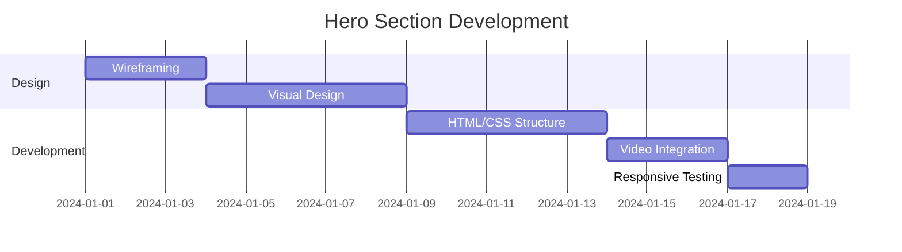
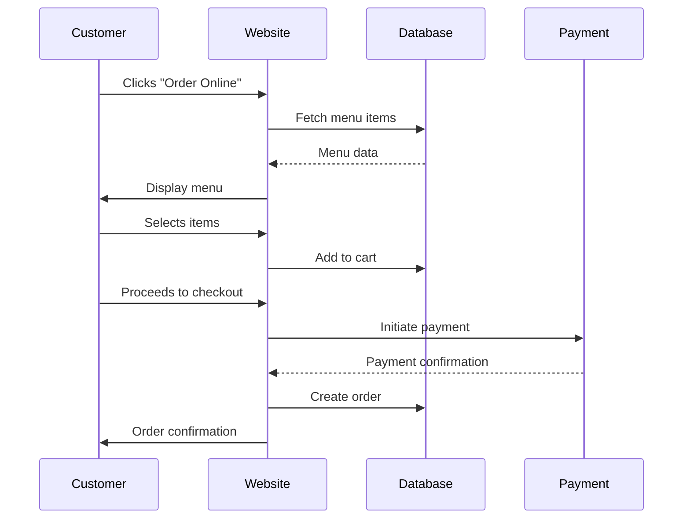
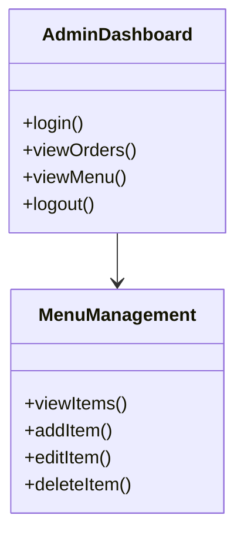
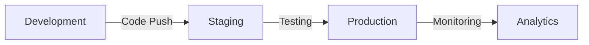
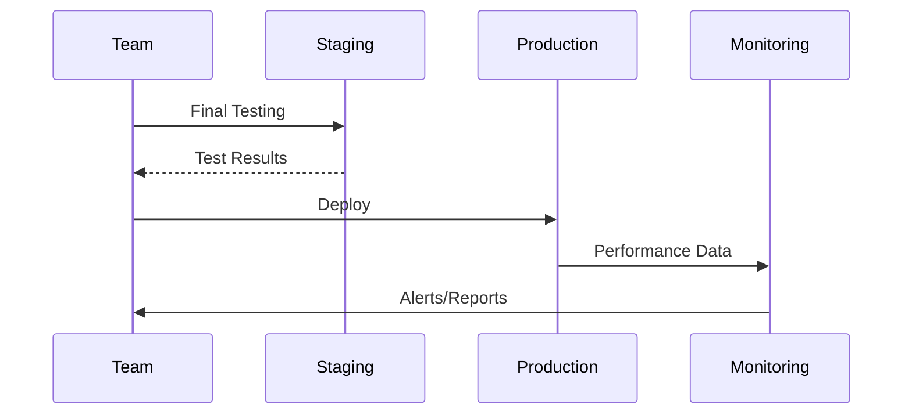
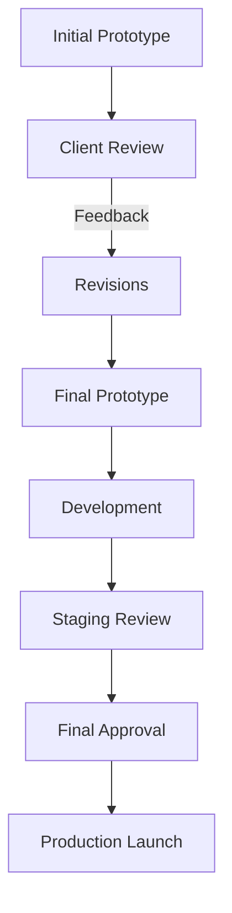
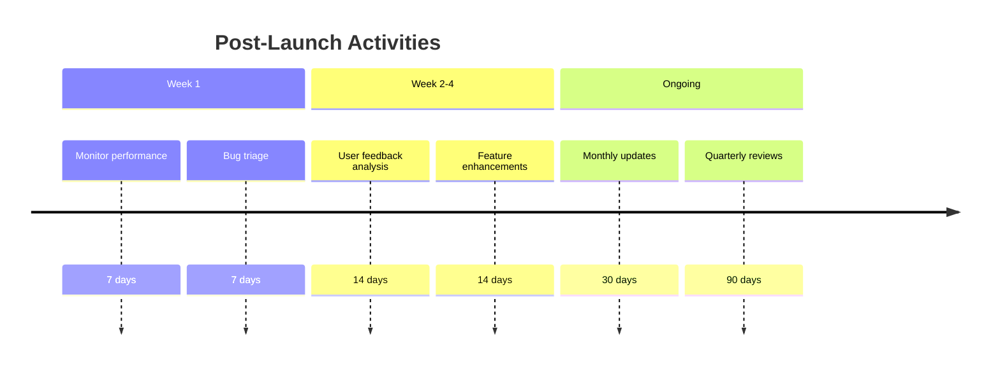

# Habiburrito Website Phased Rollout Strategy

## Overview

This document presents a detailed phased rollout strategy for the Habiburrito restaurant website, designed to ensure smooth implementation while maintaining business continuity and maximizing customer experience.

## Phase 1: Foundation & Core Features (Weeks 1-2)

### Objectives:
- Establish core website structure
- Implement essential ordering functionality
- Set up basic administrative capabilities
- Create foundational design elements

### Deliverables:

#### 1.1 Hero Section Implementation


**Tasks:**
- [ ] Create drone video placeholder with fallback image
- [ ] Implement animated typography for brand messaging
- [ ] Develop primary CTA buttons with hover effects
- [ ] Ensure mobile responsiveness
- [ ] Optimize load performance

#### 1.2 Ordering Flow Enhancement


**Tasks:**
- [ ] Optimize menu loading performance
- [ ] Implement cart persistence
- [ ] Enhance checkout flow UX
- [ ] Add order confirmation email
- [ ] Implement error handling

#### 1.3 Basic Admin Dashboard


**Tasks:**
- [ ] Implement JWT authentication
- [ ] Create order viewing interface
- [ ] Build basic menu management
- [ ] Set up role-based access control
- [ ] Implement session management

### Timeline:
- **Week 1**: Hero section + ordering flow
- **Week 2**: Admin dashboard + testing

### Success Metrics:
- 95% uptime during development
- <2s page load times
- 80% mobile responsiveness score
- Basic admin functionality operational

## Phase 2: Advanced Features (Weeks 3-4)

### Objectives:
- Enhance menu management capabilities
- Implement interactive location features
- Add social media integration
- Improve design elements

### Deliverables:

#### 2.1 Dynamic Menu System
```typescript
// Menu API Endpoint
export async function GET(request: Request) {
  try {
    const menuItems = await prisma.menuItem.findMany({
      include: {
        category: true,
        modifiers: {
          include: {
            options: true
          }
        }
      },
      orderBy: {
        category: {
          displayOrder: 'asc'
        }
      }
    });

    return NextResponse.json({
      success: true,
      data: menuItems
    });

  } catch (error) {
    return NextResponse.json({
      success: false,
      error: 'Failed to fetch menu'
    }, { status: 500 });
  }
}
```

**Tasks:**
- [ ] Implement category-based menu organization
- [ ] Add real-time menu updates
- [ ] Create modifier management system
- [ ] Implement image upload functionality
- [ ] Add pricing validation

#### 2.2 Interactive Locations
```javascript
// Google Maps Integration
import { GoogleMap, Marker, InfoWindow } from '@react-google-maps/api';

const LocationMap = ({ locations }) => {
  const [selectedLocation, setSelectedLocation] = useState(null);

  return (
    <GoogleMap
      zoom={12}
      center={{ lat: 42.3601, lng: -71.0589 }}
    >
      {locations.map(location => (
        <Marker
          key={location.id}
          position={location.coordinates}
          onClick={() => setSelectedLocation(location)}
        />
      ))}

      {selectedLocation && (
        <InfoWindow
          position={selectedLocation.coordinates}
          onCloseClick={() => setSelectedLocation(null)}
        >
          <div>
            <h3>{selectedLocation.name}</h3>
            <p>{selectedLocation.address}</p>
            <p>Hours: {selectedLocation.hours}</p>
          </div>
        </InfoWindow>
      )}
    </GoogleMap>
  );
};
```

**Tasks:**
- [ ] Implement Google Maps API integration
- [ ] Create location management interface
- [ ] Add pickup zone visualization
- [ ] Implement hours display
- [ ] Add contact information

#### 2.3 Social Media Integration
```javascript
// Instagram Feed Component
const InstagramFeed = () => {
  const [posts, setPosts] = useState([]);
  const [loading, setLoading] = useState(true);

  useEffect(() => {
    const fetchPosts = async () => {
      try {
        const response = await fetch('/api/social/instagram');
        const data = await response.json();
        setPosts(data.posts);
      } catch (error) {
        console.error('Failed to fetch Instagram posts:', error);
      } finally {
        setLoading(false);
      }
    };

    fetchPosts();
  }, []);

  if (loading) return <LoadingSpinner />;

  return (
    <div className="grid grid-cols-3 gap-4">
      {posts.map(post => (
        <div key={post.id} className="relative">
          
          <div className="absolute bottom-0 left-0 right-0 bg-black/50 text-white p-2">
            <p className="text-sm">{post.likes} likes</p>
          </div>
        </div>
      ))}
    </div>
  );
};
```

**Tasks:**
- [ ] Implement Instagram API integration
- [ ] Create TikTok embed functionality
- [ ] Add social sharing buttons
- [ ] Implement user-generated content display
- [ ] Add social media analytics

### Timeline:
- **Week 3**: Dynamic menu system + locations
- **Week 4**: Social integration + advanced admin features

### Success Metrics:
- 99% uptime
- <1.5s page load times
- 90% mobile responsiveness score
- Full admin functionality operational
- Social media feeds live

## Phase 3: Polish & Launch (Weeks 5-6)

### Objectives:
- Final design refinements
- Comprehensive testing
- Performance optimization
- Client approval
- Deployment preparation

### Deliverables:

#### 3.1 Design Refinements
```css
/* Premium Design Elements */
.hero-section {
  background: linear-gradient(
    135deg,
    rgba(5, 5, 5, 0.8),
    rgba(11, 175, 135, 0.1)
  );
  backdrop-filter: blur(10px);
}

.gold-accent {
  color: #D4AF37;
  text-shadow: 0 0 15px rgba(212, 175, 55, 0.3);
}

.parallax-effect {
  transform: translateZ(-1px) scale(1.1);
  transition: transform 0.5s ease;
}

.parallax-effect:hover {
  transform: translateZ(0) scale(1.05);
}
```

**Tasks:**
- [ ] Refine color palette consistency
- [ ] Enhance typography hierarchy
- [ ] Improve animation smoothness
- [ ] Optimize image quality
- [ ] Ensure brand consistency

#### 3.2 Comprehensive Testing
```javascript
// Test Suite Example
describe('Ordering Flow', () => {
  beforeEach(() => {
    cy.visit('/order');
  });

  it('should allow users to add items to cart', () => {
    cy.get('[data-testid="menu-item"]').first().click();
    cy.get('[data-testid="add-to-cart"]').click();
    cy.get('[data-testid="cart-count"]').should('contain', '1');
  });

  it('should handle checkout process', () => {
    // Add item to cart first
    cy.get('[data-testid="menu-item"]').first().click();
    cy.get('[data-testid="add-to-cart"]').click();

    // Proceed to checkout
    cy.get('[data-testid="checkout-button"]').click();
    cy.url().should('include', '/checkout');

    // Fill out payment form
    cy.get('[data-testid="payment-form"]').should('be.visible');
  });
});
```

**Tasks:**
- [ ] Implement end-to-end testing
- [ ] Conduct cross-browser testing
- [ ] Perform accessibility audits
- [ ] Test payment processing
- [ ] Validate mobile responsiveness

#### 3.3 Performance Optimization
```javascript
// Performance Monitoring
const performanceMetrics = {
  trackPageLoad: () => {
    const [entry] = performance.getEntriesByType('navigation');
    const pageLoadTime = entry.loadEventEnd - entry.startTime;

    // Send to analytics
    analytics.track('page_load', {
      time: pageLoadTime,
      url: window.location.href
    });
  },

  trackAPICalls: (apiName, startTime) => {
    const endTime = performance.now();
    const duration = endTime - startTime;

    analytics.track('api_call', {
      api: apiName,
      duration: duration
    });
  }
};
```

**Tasks:**
- [ ] Implement lazy loading
- [ ] Optimize image compression
- [ ] Minify CSS/JS assets
- [ ] Implement caching strategies
- [ ] Set up performance monitoring

### Timeline:
- **Week 5**: Design refinements + testing
- **Week 6**: Performance optimization + deployment prep

### Success Metrics:
- 99.9% uptime
- <1s page load times
- 95%+ mobile responsiveness score
- 100% accessibility compliance
- Zero critical bugs

## Deployment Strategy

### Staging Environment


**Tasks:**
- [ ] Set up staging environment
- [ ] Implement CI/CD pipeline
- [ ] Configure monitoring tools
- [ ] Set up error tracking
- [ ] Implement rollback procedures

### Production Launch


**Tasks:**
- [ ] Final client approval
- [ ] DNS configuration
- [ ] SSL certificate setup
- [ ] Launch monitoring
- [ ] Post-launch support plan

## Risk Management

### Risk Assessment Matrix
| Risk | Likelihood | Impact | Mitigation Strategy |
|------|-----------|--------|---------------------|
| API failures | Medium | High | Implement fallback mechanisms, caching |
| Payment issues | Low | Critical | Multiple payment options, test transactions |
| Design inconsistencies | High | Medium | Comprehensive design system, regular reviews |
| Performance bottlenecks | Medium | High | Load testing, optimization sprints |
| Security vulnerabilities | Low | Critical | Regular audits, penetration testing |

## Resource Allocation

### Team Structure
```mermaid
org
    A[Project Manager]
    A --> B[Frontend Team]
    A --> C[Backend Team]
    A --> D[Design Team]
    A --> E[QA Team]

    B --> B1[UI Developer]
    B --> B2[UX Specialist]
    C --> C1[API Developer]
    C --> C2[Database Specialist]
    D --> D1[Visual Designer]
    D --> D2[Interaction Designer]
```

## Budget Estimation

### Cost Breakdown
| Category | Estimated Cost | Notes |
|----------|---------------|-------|
| Development | $15,000-$20,000 | 4-6 weeks of work |
| Design | $5,000-$7,500 | Figma prototype + assets |
| Hosting | $500-$1,000/month | Vercel + database |
| APIs | $200-$500/month | Stripe, Google Maps, etc. |
| Testing | $2,000-$3,000 | QA + performance testing |
| Contingency | $3,000-$5,000 | Buffer for unexpected costs |

## Client Approval Process

### Approval Workflow


### Approval Checklist
- [ ] Design consistency across all pages
- [ ] Functionality meets requirements
- [ ] Performance benchmarks achieved
- [ ] Mobile responsiveness verified
- [ ] Accessibility compliance confirmed
- [ ] Security measures implemented
- [ ] Content accuracy verified
- [ ] Brand guidelines followed

## Post-Launch Strategy

### Maintenance Plan


### Success Metrics Tracking
```javascript
// Analytics Dashboard
const successMetrics = {
  trackConversions: () => {
    // Track order completions
    const conversionRate = (completedOrders / visitors) * 100;
    return conversionRate;
  },

  trackEngagement: () => {
    // Track time on site, pages per visit
    const avgTimeOnSite = totalTime / visitors;
    const pagesPerVisit = totalPages / visitors;
    return { avgTimeOnSite, pagesPerVisit };
  },

  trackRevenue: () => {
    // Track revenue metrics
    const avgOrderValue = totalRevenue / completedOrders;
    const revenueGrowth = (currentRevenue - previousRevenue) / previousRevenue;
    return { avgOrderValue, revenueGrowth };
  }
};
```

## Conclusion

This phased rollout strategy provides a comprehensive roadmap for successfully launching the Habiburrito website while minimizing risks and ensuring a high-quality user experience. The approach balances rapid development with thorough testing, allowing for iterative improvements based on real-world usage data.

**Next Steps:**
1. Finalize client approval on architecture plan
2. Begin Phase 1 development
3. Schedule regular progress reviews
4. Prepare staging environment
5. Plan launch marketing campaign